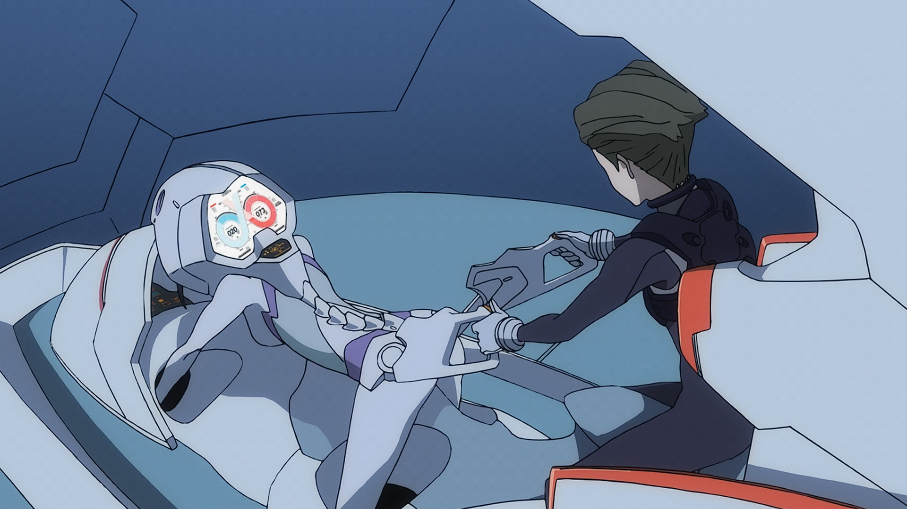
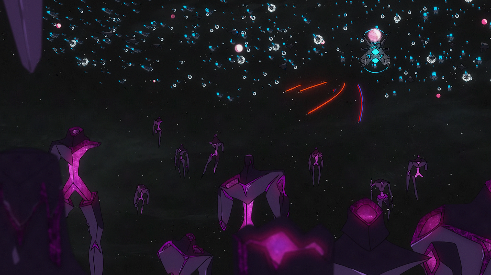
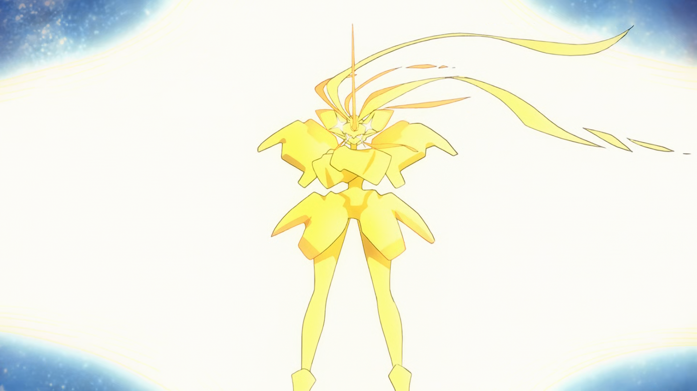

对于《Darling in the Franxx》这部片子，我个人评分是8分。  
看完之后细细回味，这部片子让我有种《EVA》（TV版）的感觉，也是老一辈动画人鼓励otaku们正视生活、坚强活下去的作品。毕竟已经有一部EVA了，对于后来者，我自然就不会给那么高评价了。如果你问我推不推荐这部番，我必然回答“不推荐”，在这eva放在现在播出绝对会被喷烂的时代，这位后来者也不可能逃过如此命运，下面我就说说我不推荐它的理由：

1. 动画里有不少作者的恶趣味，在控制室里女性奇怪的姿势就是恶趣味之一，而这也是当初国家队被喷的原因之一。  

2. 逻辑缺失，不讲道理。突然就冒出最终boss就是外星人的设定，而且这个设定前面是没有伏笔的，战斗力方面也完全没有考究的余地，正义就是能够获胜，爱情就是能战胜敌人，这也是扳机社的一大特点了。  
3. 主题是明确的，节奏是散乱的。就有种水多加面、面多加水的感觉，缺少日常刻画了，就加个日常过渡回，部分集数与其他集数之间的连接很生硬。  
4. 也有一些用完就忘了的人物，比如纯数位在都市里遇到的老奶奶，这老奶奶让他有种熟悉感，然后就没什么后续了。

如果你觉得这些都不是问题，如果你觉得“老子就好这口扳机味”“啊啊啊啊，otaku们的可能性啊”，那这部番绝对适合你，因为它有扳机社很经典的元素，诸如机甲变身、太空大战、将友谊传递出去等等。

它主题明确，就是在述说青春期少男少女们的烦恼，就是在讴歌爱情与友谊，在赞美新一代孩子们的可能性。正如它逻辑缺失的缺点一样，我认为这也是它的有点，讲道理的方式简单粗暴，正义必胜！这是一部“既不是大人，也不是小孩”的人的童话故事。  

我认为，这部番就是21世纪的eva，是动画人们写给新生代otaku们的情书，缺点虽多，但瑕不掩瑜。
