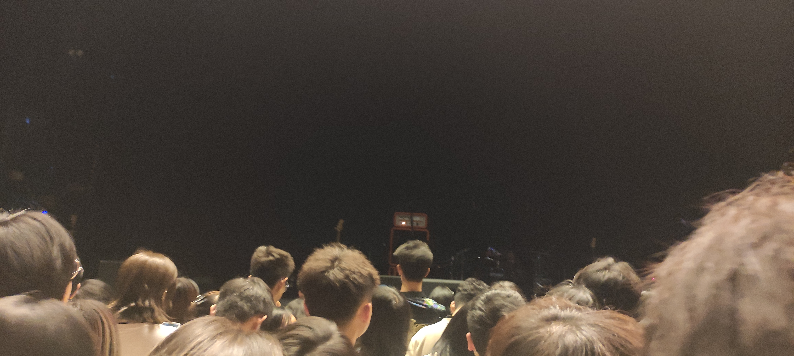

这是第一次去livehouse，因为在朋友圈看见朋友发的动态，正巧那时候有时间，于是便决定买票了，毕竟还没去看过live，也一直有想去看live的渴望。这个乐队此前我是完全没有了解过的，就单纯的一时兴起就做了决定，一是这段时间一直在听重金属，想换个口味调剂一下；二是对朋友音乐品味的信任；三是，我喜欢惊喜，说不定这个乐队的歌我也很喜欢了，要带着包容的心态。  

到了现场，没想到我那朋友也真来了，这里离他那也算远了，而且听闻他只请了半天假，晚上看完演出便坐顺风车赶着回去了，属实特种兵了。现场还有不少打扮非常日系/二次元的人，从朋友口中得知，《心理测量者》的op、ed就是这个乐队————凌冽时雨创作的，那也难怪了，也想不到这乐队对我来说并没有想象中的那么陌生。我以前是非常喜欢pp来着。  

看完live，很棒，现场听歌和在耳机听歌真的完全不是一个档次的，现场氛围也很好，不过我是安静听歌派，也因为和这个乐队不怎么熟，所以就没跟着一起嗨。现在非常希望能有机会去看一次重型乐队的表演，到时候我一定会跟着一起甩头，下次也一定把耳塞带上，这次live感觉声音就挺大的，结束后还有点听不清周围的声音，更不用说重金属。耳朵还是得保护好，只有这样才能听歌听到老。